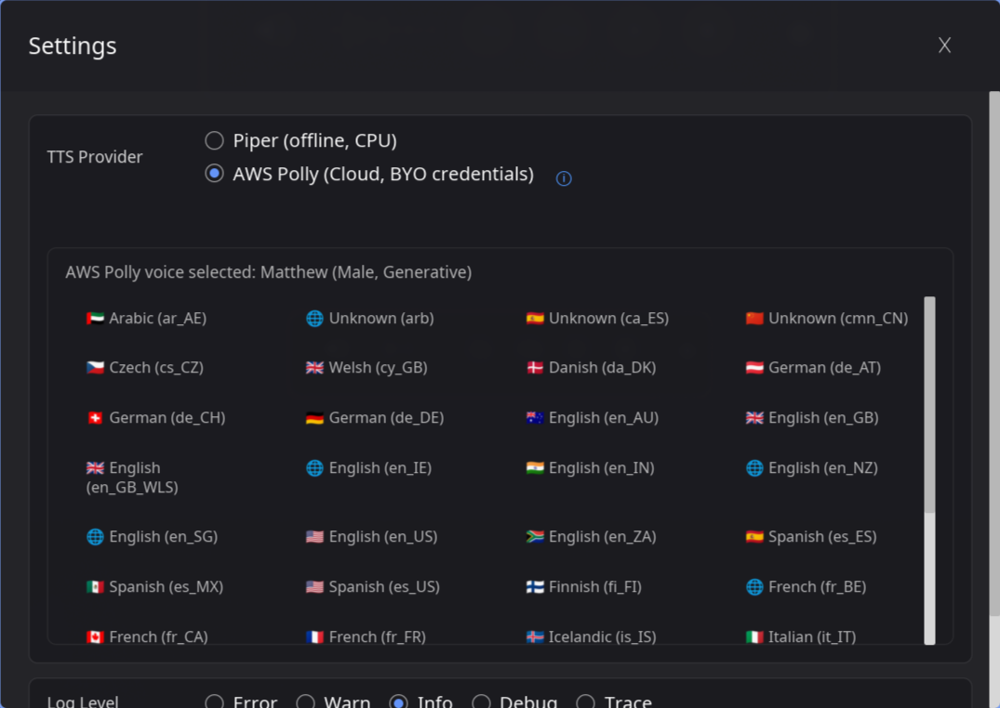

<div align="center">

<h1> Insight Reader</h1>

</div>
Insight Reader is a free, cross-platform text-to-speech application that reads text from your system clipboard selections, images, or screenshots. It features 100+ free, local voices via Piper (offline, privacy-focused, and unlimited usage), high-quality neural voices through AWS Polly, and native OCR support across Windows, macOS, and Linux. With seamless system integration, global hotkeys, and a floating interface, it transforms any text into natural speech instantly.

<br/>
<br/>  


<div align="center">


</div>


<div align="center">


</div>

## 🚀 Easy installation

### MacOs and Linux

Open  **Terminal** and run:

```bash
curl -fsSL https://insightreader.xyz/install.sh | bash
```

### Windows

Open  **PowerShell** and run:

```powershell
iwr https://insightreader.xyz/install.ps1 | iex
```

## ✨ Features

<table style="border: none;">
<tr>
<td width="50%" style="border: none;">

**🌍 Multiple TTS Providers**
- **<a href="https://github.com/rhasspy/piper" target="_blank" rel="noopener noreferrer">Piper</a>** (local, offline) - Fast, privacy-focused local TTS with 100+ voices
- **<a href="https://aws.amazon.com/polly/" target="_blank" rel="noopener noreferrer">AWS Polly</a>** (cloud) - High-quality neural voices with multiple engines (Standard, Neural, Generative, LongForm)
- *More to come...*

**🎨 Modern GUI**
- Floating borderless window with drag support
- Real-time waveform visualization
- Play/pause/stop controls
- Skip forward/backward (5 seconds)
- Modern settings dialog with scrollable content
- Hotkey configuration UI with live capture
- Voice download interface with language flags

</td>
<td width="50%" style="border: none;">

**🎯 System Integration**
- Works with any application (browser, editor, etc.)
- Cross-platform support (Windows, Linux, macOS)
- System tray icon with quick access menu
- Global hotkeys (Windows, macOS)
- Natural Reading (text cleanup) toggle
- OCR support for reading text from images (Windows Media OCR, macOS Vision, Linux EasyOCR)


**⚡ Lightning Fast**
- Native Rust performance
- Streaming audio playback
- Low latency audio synthesis

**🔊 High Quality**
- Super high quality neural audio synthesis
- Multiple voice engines (Standard, Neural, Generative, LongForm for AWS Polly)


</td>
</tr>
</table>

## 📊 Tested Platforms
This project runs extensive testing for reliability and maintainability.

<div align="center">

**Release tested on:**

| Platform | Desktop Environment / WM | Status |
|----------|------------------------|--------|
|  **macOS** | Apple Silicon (M1/M2/M3) | ✅ Tested |
|  **macOS** | Intel | ✅ Tested |
|  **Windows 11** | Desktop | ✅ Tested |
|  **Windows 10** | Desktop | ✅ Tested |
|  **Ubuntu** |  GNOME (Wayland) | ✅ Tested |
|  **Fedora** |  GNOME (Wayland) | ✅ Tested |
|  **Manjaro Linux** |  KDE (Wayland) | ✅ Tested |
|  **Arch Linux** |  Hyprland (Wayland) | ✅ Tested |

</div>
While it should work on other platforms, these are the primary tested environments.

## 📸 Screenshots

<div align="center">

### Main Window


*Floating borderless window with waveform visualization and playback controls*

### OCR Screenshot Capture


*Capture screenshots and extract text using native OCR (Windows Media OCR, macOS Vision, Linux EasyOCR)*

### Settings Window


*Comprehensive settings with provider selection, voice management, and configuration options*

### Voice Download Interface


*Browse and download Piper voices with language flags and voice preview*

### System Tray Integration
<table>
<tr>
<td align="center">
<strong>Windows</strong><br>

</td>
<td align="center">
<strong>macOS</strong><br>

</td>
<td align="center">
<strong>Linux</strong><br>

</td>
</tr>
</table>

*Quick access from system tray with menu options and configured hotkey display*

</div>


#### AWS Polly Setup (Optional)

To use AWS Polly, configure your AWS credentials:

1. **Environment variables** (recommended):
   ```bash
   export AWS_ACCESS_KEY_ID="your-access-key"
   export AWS_SECRET_ACCESS_KEY="your-secret-key"
   export AWS_REGION="us-east-1"  # optional, defaults to us-east-1
   ```

2. **Or credentials file** (`~/.aws/credentials`):
   ```ini
   [default]
   aws_access_key_id = your-access-key
   aws_secret_access_key = your-secret-key
   ```

3. **Or named profile** (`~/.aws/credentials`):
   ```ini
   [profile myprofile]
   aws_access_key_id = your-access-key
   aws_secret_access_key = your-secret-key
   ```
   Then set: `export AWS_PROFILE=myprofile`

## 🎯 Usage

### Basic Usage

1. **Select text** in any application (browser, editor, etc.)
2. **Run Insight Reader**:
3. The application will:
   - Read the selected text automatically
   - Display a floating window
   - Start speaking immediately


## 🔧 Advanced Usage

### System Tray & Hotkeys

**System Tray:**
- Access Insight Reader from the system tray (menu bar on macOS)
- Quick actions: Read selected text, Show/Hide window, Quit
- Displays configured hotkey in the menu

**Global Hotkeys:**
- Configure custom hotkeys to trigger text reading
- Works on Windows and macOS
- Hotkeys are displayed in the tray menu for quick reference
- **Note for Linux Wayland users**: Global hotkeys require compositor configuration (e.g., Hyprland key bindings)

### OCR (Optical Character Recognition)

Read text directly from images and screenshots:
- **Windows**: Native Windows Media OCR API (fast and reliable)
- **macOS**: Vision framework integration
- **Linux**: EasyOCR support
- Screenshot capture with region selection (Windows)
- Preserves line breaks for better text structure

## 📝 Logging

Logs are written to:
- **Stderr**: Real-time console output
- **File**:
  - **Linux/macOS**: `~/.local/share/insight-reader/logs/insight-reader-YYYY-MM-DD.log`
  - **Windows**: `%LOCALAPPDATA%\insight-reader\logs\insight-reader-YYYY-MM-DD.log`

## 🛠️ Troubleshooting

### Common Issues

**"No audio playback"**
- Check that your system audio is working

**"AWS Polly not working"**
- Verify AWS credentials are configured (see [AWS Polly Setup](#aws-polly-setup-optional))
- Check error messages in the settings window
- Verify AWS credentials have Polly permissions

**"Clipboard not working"**
- **Windows**:
  - Ensure the text is copied to clipboard before running Insight Reader
  - Try copying the text again (Ctrl+C) and then run Insight Reader
- **macOS**: 
  - Grant accessibility permissions: **System Preferences/Settings → Security & Privacy → Privacy → Accessibility**
  - Add Insight Reader (or Terminal if running from terminal) to the allowed apps list
  - Try selecting text before running Insight Reader

**"Screenshot capture not working"** (Windows)
- Windows uses native Windows Media OCR API (no PowerShell required)
- Ensure you have proper permissions for screen capture
- Press Escape to cancel screenshot selection

**"Global hotkeys not working"** (Linux Wayland)
- Global hotkeys are not supported on Wayland compositors (except with manual configuration)
- For Hyprland users: Configure key bindings in your Hyprland config file
- The application will show a message if hotkeys are not supported on your platform

**"Piper TTS not found"** (Windows)
- Verify Python venv was created: `%LOCALAPPDATA%\insight-reader\venv\Scripts\piper.exe`
- Run the installation script again: `.\install\install-windows.ps1 -Force`

**"System tray icon not showing"** (Linux)
- Ensure GTK dependencies are installed:
  - **Arch Linux / Manjaro**: `sudo pacman -S gtk3 libappindicator-gtk3`
  - **Debian / Ubuntu**: `sudo apt install libgtk-3-dev libappindicator3-dev`
- **GNOME users**: Install the "AppIndicator Support" extension from [GNOME Extensions](https://extensions.gnome.org/)
- The application will continue to work without the tray icon if dependencies are missing

## 🗺️ Roadmap
<table style="border: none;">
<tr>
<td width="50%" style="border: none; vertical-align: top; font-size: 0.9em;">

- [<span style="color: green;">✓</span>] Multiple TTS providers (Piper, AWS Polly)
- [<span style="color: green;">✓</span>] Real-time waveform visualization
- [<span style="color: green;">✓</span>] Piper Voice download from UI
- [<span style="color: green;">✓</span>] Cross-platform support (Linux, macOS, Windows)
- [<span style="color: green;">✓</span>] Settings persistence to file
- [<span style="color: green;">✓</span>] Windows & Mac support with native OCR
- [<span style="color: green;">✓</span>] Linux OCR with EasyOCR 
- [<span style="color: green;">✓</span>] System tray icon (Windows, macOS, Linux)
- [<span style="color: green;">✓</span>] Global hotkeys (Windows, macOS)
- [<span style="color: green;">✓</span>] OCR support for reading images (Windows, macOS, Linux)
- [<span style="color: green;">✓</span>] Hotkey configuration UI
- [<span style="color: green;">✓</span>] Beautiful floating GUI
- [ ] Plugin system for custom Local TTS and OCR providers
- [ ] Document mode (docx, pdf)
- [ ] Batch text processing
- [ ] Audio export functionality
- [ ] OCR Text formating and export functionality
- [ ] Kokoro Voices
- [ ] Auto Start (Windows, Mac and Linux)


</td>
<td width="50%" style="border: none; vertical-align: top; font-size: 0.9em;">

- [ ] Natural reading  
- [ ] AI OCR enhancement  
- [ ] Document mode (docx, pdf, md, google docs)  
- [ ] Eleven Labs Voices  
- [ ] Voice Cloning  
- [ ] SSML tags creation and reading  
- [<span style="color: green;">✓</span>] Natural Reading support

</td>
</tr>
</table>

## 🤝 Contributing

We welcome contributions! Please feel free to:
- Report bugs and issues
- Suggest new features
- Improve documentation
- Design UI/UX improvements

## 🙏 Acknowledgments

- Built with [Iced](https://iced.rs/) GUI framework
- Uses [Piper TTS](https://github.com/rhasspy/piper) for local TTS
- AWS Polly integration via AWS SDK for Rust
- Audio playback powered by [rodio](https://github.com/RustAudio/rodio)
- Waveform visualization using [rustfft](https://github.com/ejmahler/rustfft)
- Windows OCR via Windows Media OCR API
- macOS OCR via Vision framework
- Linux OCR via [EasyOCR](https://github.com/JaidedAI/EasyOCR)

---


<div align="center">

[GitHub](https://github.com/gabepsilva/insight-reader) • [Issues](https://github.com/gabepsilva/insight-reader/issues) • [Releases](https://github.com/gabepsilva/insight-reader/releases)

</div>
